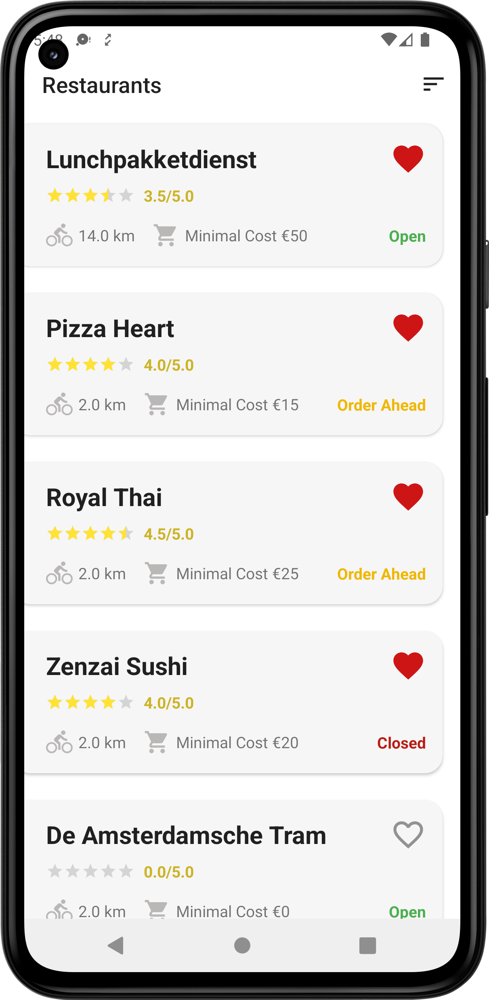
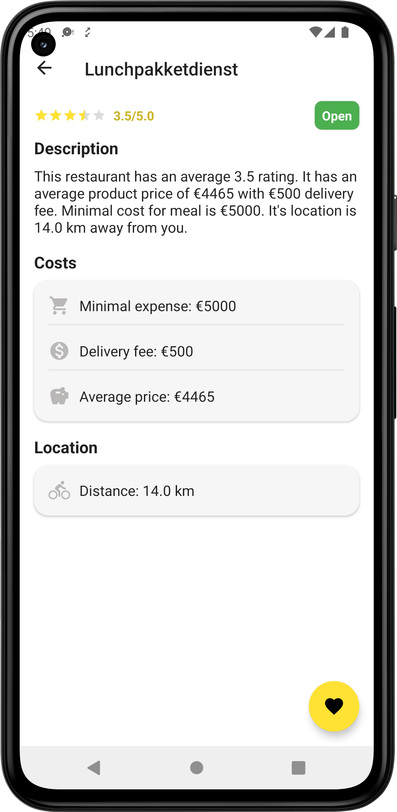
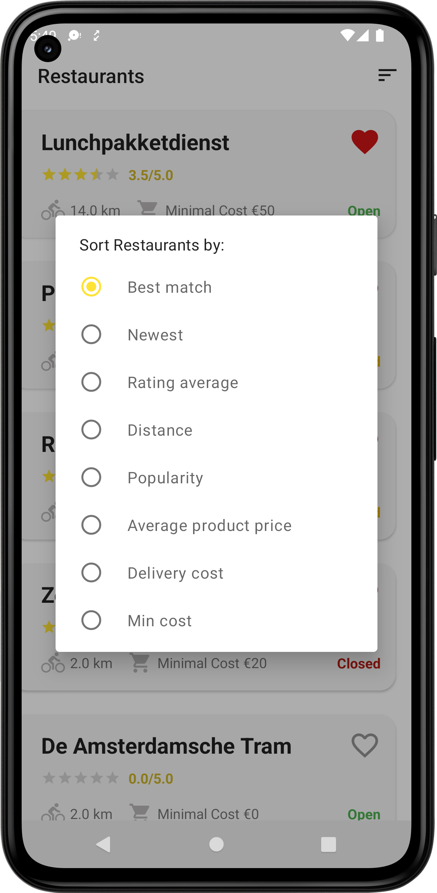
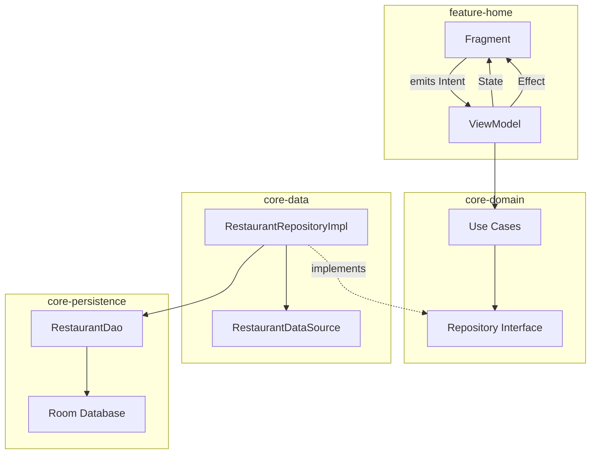
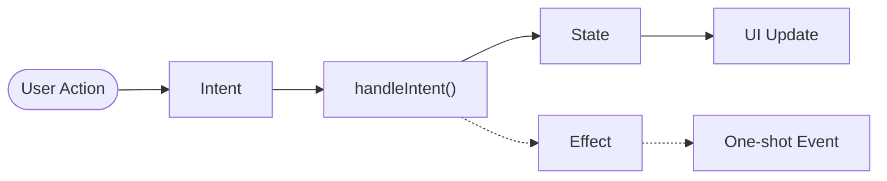

# 🍔 Restaurant App

A restaurant listing app built with MVI architecture and clean architecture principles. Shows a list of restaurants with sorting, favoriting, and detail views.

[](https://github.com/kl3jvi/mvi_clean_architecture/issues)
[](https://github.com/kl3jvi/mvi_clean_architecture)
[](/LICENSE)

## Screenshots

[](images/sc_1.png)
[](images/sc_2.png)
[](images/sc_3.png)

## Architecture

The app follows MVI (Model-View-Intent) with unidirectional data flow. Each screen has its own ViewModel that handles user intents and emits state updates.



### MVI Flow



**Key components:**
- **Intent** — User actions (tap sort, toggle favorite, etc.)
- **State** — Immutable UI state, survives config changes
- **Effect** — One-time events (show toast, navigate)

## Module Structure

```
├── app                   # Main app, DI setup
├── feature-home          # Home + Details screens
├── core-domain           # Use cases, repository interfaces
├── core-data             # Repository implementations, data sources
├── core-persistence      # Room database, DAOs
├── core-model            # Shared data models
└── core-common           # Utilities, base classes
```

## Tech Stack

- Kotlin, Coroutines, Flow
- Jetpack (ViewModel, Room, Navigation, DataBinding)
- Hilt for DI
- Material Components
- Turbine for Flow testing

## Building

```bash
# Debug build
./gradlew assembleDebug

# Run tests
./gradlew testDebugUnitTest
```

**Requirements:** JDK 17+, Android SDK 34

## Contributing

PRs welcome! Fork, make changes, submit a pull request.
